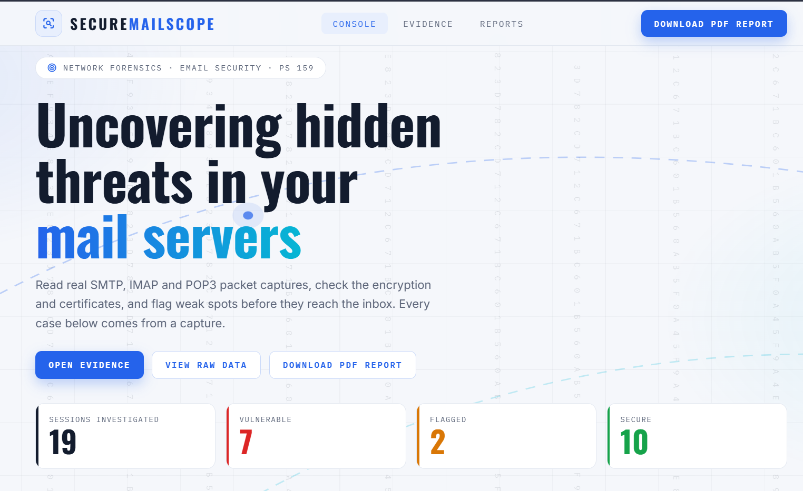
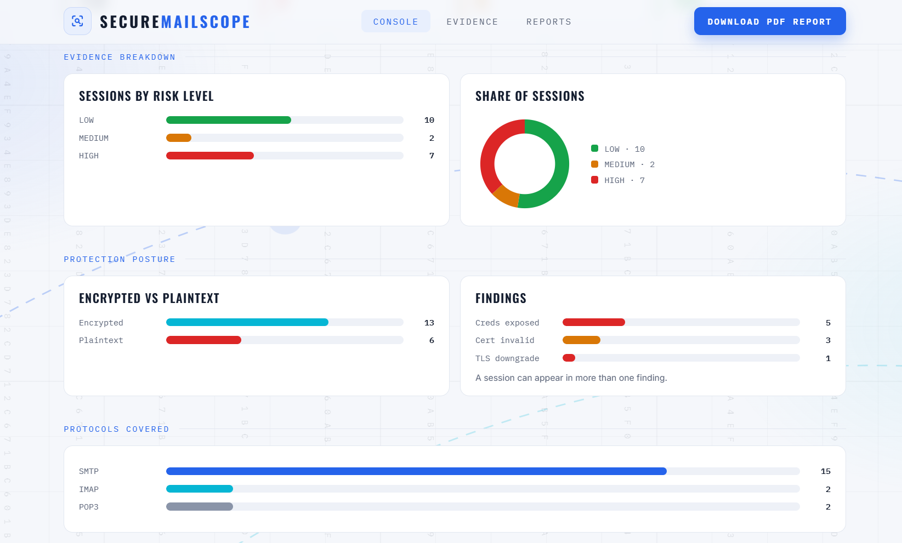
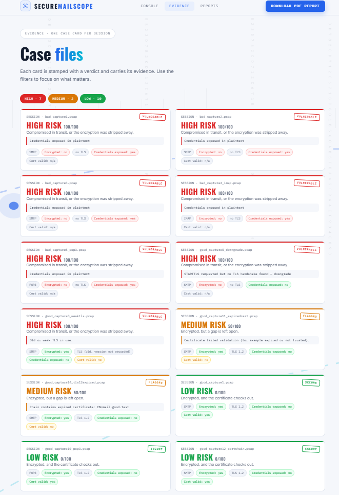
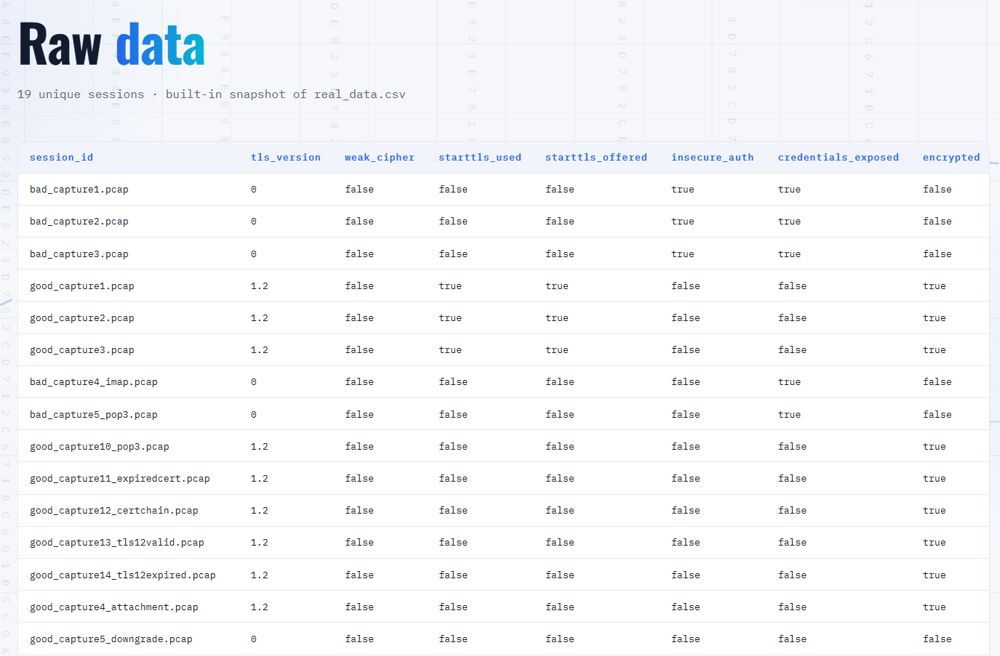

# SecureMailScope

**A passive forensic tool that reads saved email traffic (SMTP, IMAP, POP3) and tells you how safe its encryption is.**

Smart India Hackathon 2026 | Software | NTRO: Blockchain & Cybersecurity

## The problem
Email servers often use weak encryption, expired certificates, or can be tricked into sending mail with no encryption at all (a STARTTLS downgrade). Most tools test live servers. We analyze **captured traffic (PCAP files)**, so nothing is probed and nothing is touched.

## What it does
Give it a PCAP file. It gives back a **risk score with a plain-English reason** for every email session.

## What is built and tested
- Reads SMTP, IMAP and POP3 sessions from PCAP files
- Reads the TLS handshake: version, cipher, key exchange, certificates
- Checks certificates: expiry, chain linking, key size, signature algorithm
- Detects plaintext logins and leaked credentials
- Detects STARTTLS downgrade (encryption skipped)
- Scores risk with rules + ML (Isolation Forest, Random Forest, SHAP explanations)
- FastAPI backend and dashboard
- Real test lab: 16+ captures made with Docker mail servers (good and bad TLS setups)

## How it works
PCAP → Stream extraction → TLS parser → Certificate rules → AI risk engine → API → Dashboard

## Screenshots





## How to run
Start the API:
```
git clone https://github.com/jeevikagowda7/sih26-securemailscope
cd sih26-securemailscope/06-api
pip install -r requirements.txt
uvicorn main:app --reload
```

Start the dashboard (in a second terminal):
```
cd sih26-securemailscope/07-dashboard
streamlit run app.py
```

## Detailed Report
[Read the full report (PDF)](08-reports-docs/sample-report/SecureMailScope_Report.pdf)

## Folders
| Folder | What it does |
|---|---|
| 01-data-lab | Docker mail servers and captured PCAPs |
| 02-pcap-streams | Splits PCAPs into email sessions |
| 03-tls-parser | Reads TLS handshake and certificates |
| 04-certs-rules | Certificate checks and risk rules |
| 05-ml-ai | Anomaly detection and explanations |
| 06-api | FastAPI backend |
| 07-dashboard | Streamlit dashboard |
| 08-reports-docs | Report and screenshots |

## Team
Sumaiya, Varshini, Jeevika, Krithiksha, Gowri, Safa

## References
- NIST SP 800-52 Rev. 2
- RFC 8314 (TLS for email)
- Durumeric et al., ACM IMC 2015 (STARTTLS stripping study)

*All keys, certificates and passwords in this repo are throwaway test data.*
